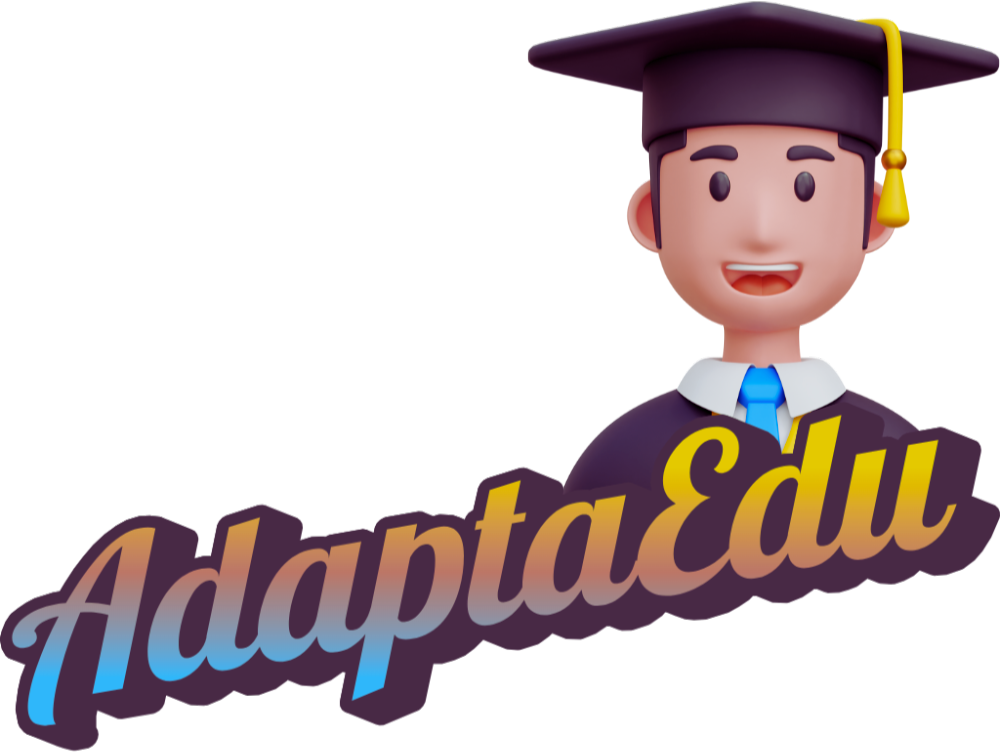

# AdaptaEdu

<div align="center">
  
</div>

## Sobre

AdaptaEdu é uma plataforma educacional inteligente que utiliza IA para criar experiências de aprendizado personalizadas. O sistema permite upload de materiais didáticos, indexação inteligente e interação através de chat alimentado por RAG (Retrieval-Augmented Generation).

## Estrutura do Repositório

O projeto está organizado em três componentes principais:
```
adaptaedu/
├── adaptaedu/              # Frontend da aplicação
├── adaptaedu-api/          # API de chat e consulta ao banco de dados
└── adaptaedu-sistema-rag/  # Sistema de indexação e upload de materiais
```

### 📱 [adaptaedu](./adaptaedu/README.md)
Interface frontend da plataforma onde usuários interagem com o sistema educacional.

### 🔌 [adaptaedu-api](./adaptaedu-api/README.md)
API responsável pelo chat inteligente e consultas ao banco de dados.

### 🗄️ [adaptaedu-sistema-rag](./adaptaedu-sistema-rag/README.md)
Sistema local para upload e indexação de materiais didáticos em banco de dados na nuvem.

## Começando

Cada componente possui seu próprio README com instruções detalhadas de instalação e uso.

1. Configure o sistema RAG para indexar os materiais
2. Inicie ou acesse a API (https://adaptaedu-api.vercel.app/)
3. Execute ou acesse o frontend (https://adaptaedu.vercel.app/)

Para instruções específicas, consulte o README de cada pasta.

Desenvolvido por Alexandre Lins