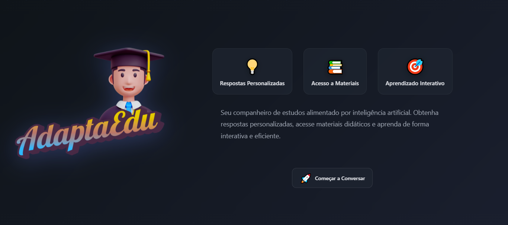

# AdaptaEdu - Assistente Educacional Inteligente

Plataforma de chat educacional alimentada por inteligência artificial e sistema RAG próprio, para aprendizado personalizado e interativo.

## 📸 Preview



## 🌐 Demo

🔗 **[Acesse a aplicação](https://adaptaedu.vercel.app/)**

## ✨ Funcionalidades

- 💬 **Chat Interativo**: Conversação em tempo real com assistente IA educacional
- 📚 **Materiais Didáticos**: Acesso a PDFs, vídeos, imagens e áudios
- 🎯 **Respostas Personalizadas**: Sistema de referências e fontes citadas
- ⚡ **Efeito Typewriter**: Animação de digitação nas respostas
- 📱 **Interface Responsiva**: Design adaptável para mobile e desktop
- 🌙 **Tema Dark**: Interface moderna com gradientes e glassmorphism

## 🛠️ Tecnologias

- **React** - Biblioteca JavaScript para UI
- **Vite** - Build tool e dev server
- **CSS Moderno** - Variables, animations, backdrop-filter
- **REST API** - Integração com backend Node.js


## 📁 Estrutura do Projeto

```
src/
├── components/
│   ├── ChatInput.jsx         # Input de mensagens
│   ├── ChatMessages.jsx       # Lista de mensagens
│   ├── Message.jsx            # Componente de mensagem
│   ├── ContentSidebar.jsx     # Sidebar para visualização de conteúdo
│   └── TypingIndicator.jsx    # Indicador de digitação
├── Home.jsx                   # Página inicial
├── Chat.jsx                   # Página de chat
└── App.jsx                    # Componente principal
```

## 🎨 Características de Design

- Gradientes dinâmicos e animações suaves
- Sistema de cores baseado em CSS Variables
- Efeitos glassmorphism e backdrop blur
- Transições e animações personalizadas
- Scrollbars customizadas

## 📝 API

Integração com backend em:
```
https://adaptaedu-api.vercel.app/api
```

Endpoints principais:
- `POST /chat` - Enviar mensagens e receber respostas


Desenvolvido por Alexandre Lins